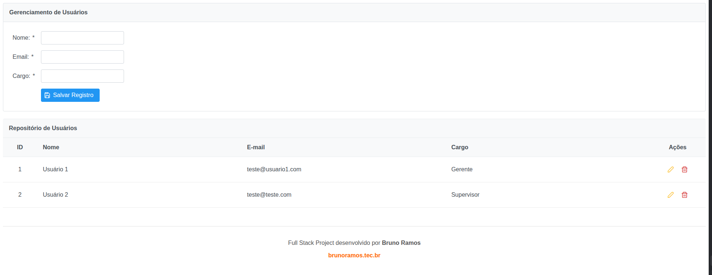

# User Management System - Java Fullstack

Este projeto é um CRUD completo de usuários desenvolvido para consolidar conhecimentos no ecossistema Java corporativo. A aplicação utiliza uma arquitetura multicamadas, integrando o **Spring Boot** para o backend e **JSF (JavaServer Faces)** com **PrimeFaces** para uma interface rica e reativa.

## Tecnologias Utilizadas

* **Java 17** (Amazon Corretto)
* **Spring Boot 3.2.4** (Framework core)
* **Spring Data JPA / Hibernate** (Persistência e ORM)
* **JSF 4.0 / PrimeFaces 13** (Interface do usuário com componentes ricos)
* **JoinFaces** (Integração Spring + JSF)
* **H2 Database** (Banco de dados em memória para desenvolvimento rápido)
* **Maven** (Gerenciamento de dependências e build)
* **Lombok** (Produtividade e redução de Boilerplate)
* **Jakarta Bean Validation** (Integridade e validação de dados)

## Estrutura do Projeto

O projeto segue o padrão de convenção do Maven:

* `src/main/java`: Contém a lógica de negócio dividida em pacotes:
    * `.model`: Entidades JPA (Mapeamento Objeto-Relacional).
    * `.repository`: Interfaces Spring Data para comunicação com o banco.
    * `.controller`: Managed Beans JSF para controle da View.
* `src/main/resources`: Arquivos de configuração (`application.properties`).
* `src/main/resources/META-INF/resources`: Páginas front-end (`.xhtml`).

## Como Executar

### Pré-requisitos
* JDK 17 ou superior.
* Maven 3.x instalado (ou utilizar o Maven Wrapper incluído).

### Passos
1.  Clone o repositório:
    ```bash
    git clone https://github.com/thinkbruno/crud-java-fullstack.git
    ```
2.  Navegue até a pasta:
    ```bash
    cd crud-java-fullstack
    ```
3.  Execute a aplicação:
    ```bash
    ./mvnw spring-boot:run
    ```
4.  Acesse no navegador:
    ```text
    http://localhost:8080/index.xhtml
    ```

---

## Detalhes de Implementação

* **Validação:** O sistema valida e-mails e campos obrigatórios diretamente na Entidade usando `@Email` e `@NotBlank`.
* **Persistência:** Utiliza o Hibernate para geração automática de tabelas e comandos SQL.
* **UI/UX:** Componentes PrimeFaces com suporte a AJAX para deleção com confirmação e edições sem refresh de página.

---

## Frontend do projeto



---
Desenvolvido por **Bruno Ramos** 🔗 [brunoramos.tec.br](https://brunoramos.tec.br/)